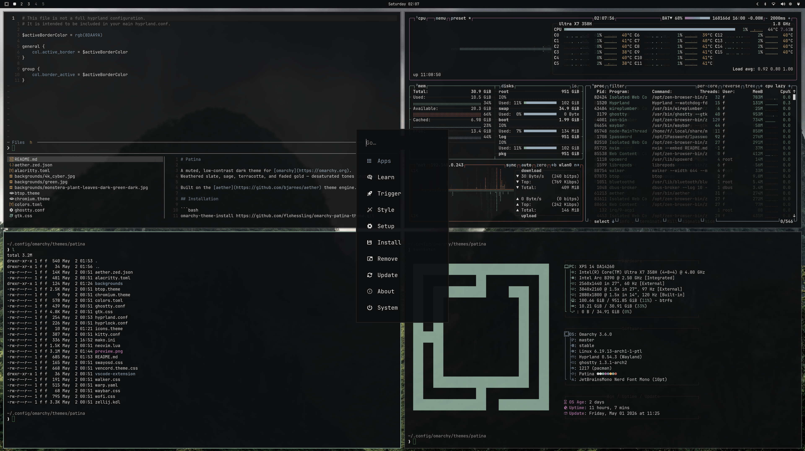

# Patina

A muted, low-contrast dark theme for [omarchy](https://omarchy.org).
Weathered slate, sage, terracotta, and faded gold — desaturated tones inspired by [no-clown-fiesta](https://github.com/aktersnurra/no-clown-fiesta.nvim), with adjustments throughout.

Built on the [aether](https://github.com/bjarneo/aether) theme engine.

## Installation

```bash
omarchy-theme-install https://github.com/flohessling/omarchy-patina-theme.git
```

## What's themed

Alacritty, Ghostty, Kitty, Warp, Zellij, Hyprland, Hyprlock, Waybar, Walker, Wofi, Mako, SwayOSD, GTK, btop, Neovim (via aether.nvim), VS Code, Zed, Chromium, Vencord.

## Preview



## License

MIT
