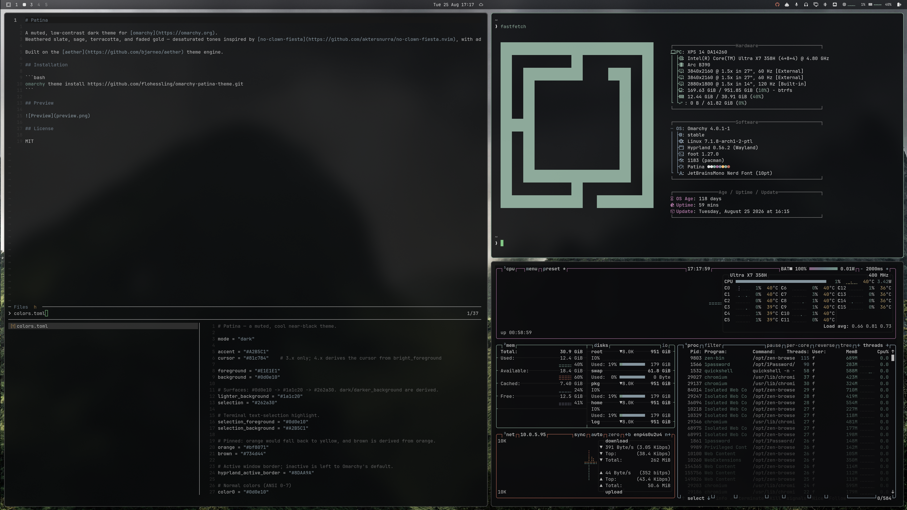

# Patina

A muted, low-contrast dark theme for [omarchy](https://omarchy.org).
Weathered slate, sage, terracotta, and faded gold — desaturated tones inspired by [no-clown-fiesta](https://github.com/aktersnurra/no-clown-fiesta.nvim), with adjustments throughout.

Built on the [aether](https://github.com/bjarneo/aether) theme engine.

## Installation

```bash
omarchy theme install https://github.com/flohessling/omarchy-patina-theme.git
```

## Preview



## License

MIT
